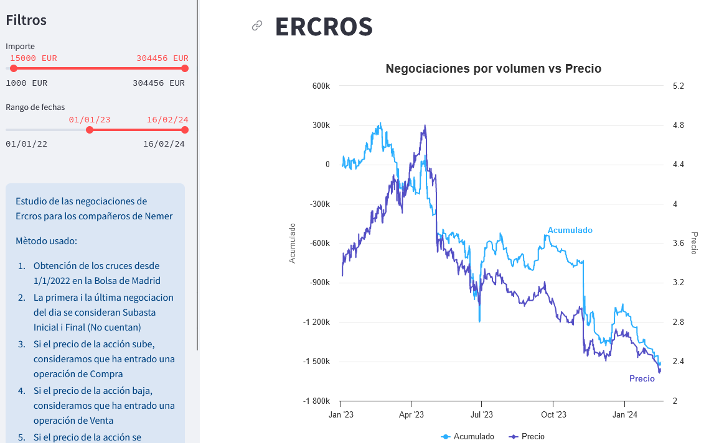

# Estudi de la correlació entre el volum de les negociacions d'accions d'Ercros i el preu

Estudi experimental de les negociacions d'Ercros per als companys de Nemer

Mètode usat:

     1. Obtenim les operacions des de l' 1/1/2022 de la borsa de Madrid (XMAD)
     2.  La primera i la darrera negociació del dia es consideren Subhasta Inicial (SI) i Final (SF)
     3. Si el preu de l'acció puja, considerem que ha entrat una operació de compra
     4. Si el preu de l'acció baixa, considerem que ha entrat una operació de venda
     5. Si el preu de lacció es manté, considerem que continua l'operació Anterior
     6.Si és una compra sumem el nombre d'accions a l'acumulat i si és una venda el restem
     7. Si és una operació a Subhasta, no computa per a l'acumulat

La idea és saber si hi ha una relació entre les "grans" compres/vendes i el que succeirà en un futur.

S'admeten suggeriments !

Concepte de Mans fortes, inspirat en els indicadors del gran Blai5: 
- https://www.blai5.net/tag/manos-fuertes/
- https://www.blai5.net/blai5-koncorde-que-es-y-como-usarlo/

